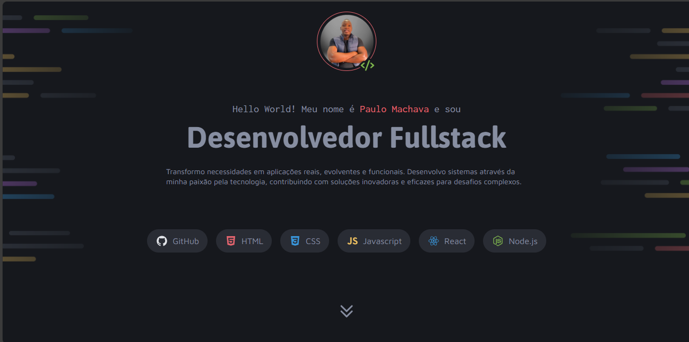

<h1 align="center">Portfolio Dev</h1>

Desafio de formação promovido pela Rocketseat para ensino de tecnologias WEB.  

  <a href="#-tecnologias">Tecnologias</a>&nbsp;&nbsp;&nbsp;|&nbsp;&nbsp;&nbsp;
  <a href="#-projeto">Projeto</a>&nbsp;&nbsp;&nbsp;|&nbsp;&nbsp;&nbsp;
  <a href="#memo-licença">Licença</a>

  

 

  

## 🚀 Tecnologias

Esse projeto foi desenvolvido com as seguintes tecnologias:

- HTML e CSS
- Git e Github
- Figma

## 💻 Projeto

O projeto é um site desktop de portfólio para desenvolvedores, com links para projetos e contato do profissional. 
Esse é um dos desafios práticos da formação Fullstack, um dos conteúdos disponíveis para alunos da Rocketseat. 

## :memo: Licença

Esse projeto está sob a licença MIT.

---

Feito com ♥ by Paulo Nachava
